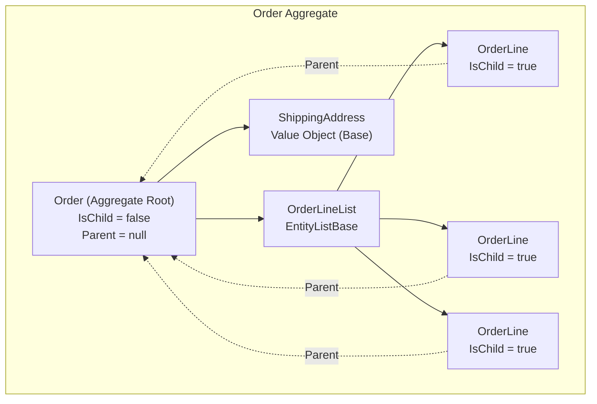

Aggregates are clusters of domain objects treated as a single unit. In Neatoo, aggregates form naturally through entity relationships, with automatic parent assignment, modification tracking, and validation propagation throughout the object graph.

## What is an Aggregate?

An Aggregate is a cluster of entities and value objects with a defined boundary. All access from outside the aggregate must go through a single entry point called the **Aggregate Root**.

### Real-World Analogy: The Order Form

Think of a paper order form. The form contains:

- Header information (order date, customer reference)
- Line items (products, quantities, prices)
- Totals and calculations
- Payment details

When you work with this form:

1. You pick up the **entire form**, not individual line items
2. You add or remove line items **through the form**
3. When you submit, **everything goes together**
4. The form **validates itself** (do totals match? are required fields filled?)

You cannot walk into the warehouse with just a line item and say "ship this." The line item only makes sense in the context of its order.

This is exactly how Neatoo aggregates work.

## The Aggregate Root Pattern

The Aggregate Root is the top-level entity that:

- Has global identity (can be referenced from outside the aggregate)
- Controls access to all entities within the aggregate
- Enforces invariants across the entire aggregate
- Serves as the unit of persistence

### In Neatoo Terms

```csharp
[Factory]
internal partial class Order : EntityBase<Order>, IOrder
{
    public partial Guid? Id { get; set; }              // Global identity
    public partial DateTime OrderDate { get; set; }
    public partial string? CustomerName { get; set; }
    public partial IOrderLineList? Lines { get; set; } // Child collection
    public partial decimal Subtotal { get; set; }
    public partial decimal Tax { get; set; }
    public partial decimal Total { get; set; }
}
```

The `Order` is the Aggregate Root. The `Lines` collection contains child entities that:

- Cannot be saved independently
- Reference the Order as their Parent
- Contribute to the Order's modification and validation state

## Aggregate Structure Diagram



Key observations:

- **Order** has no parent (`Parent == null`) and `IsChild == false`
- **OrderLine** entities have `IsChild == true` and `Parent` pointing to Order
- **ShippingAddress** is a value object (uses `Base<T>`), not an entity
- The entire structure saves and loads as a unit

## Parent-Child Relationships

Neatoo automatically manages parent-child relationships through two mechanisms.

### Automatic Parent Assignment

When you assign an entity to another entity's property, the framework:

1. Sets the child's `Parent` property to the parent entity
2. Calls `MarkAsChild()` on the child
3. Subscribes to the child's property change events

```csharp
// In Order's Create method
[Create]
public void Create([Service] IOrderLineListFactory lineListFactory)
{
    Lines = lineListFactory.Create();
    // Lines.Parent is now set to this Order
}
```

### Collection Item Parent Assignment

When items are added to an `EntityListBase`, the framework:

1. Sets the item's `Parent` to the list's parent (not the list itself)
2. Marks the item as a child
3. Registers for property change events

```csharp
var order = await orderFactory.Create();
var newLine = await order.Lines.AddLine();
// newLine.IsChild == true
// newLine.Parent == order (not order.Lines)
```

Note that `Parent` points to the **Order**, not the **OrderLineList**. This allows line items to access their parent order directly.

### Accessing the Parent

Child entities can cast `Parent` to access parent-specific functionality:

```csharp
internal partial class OrderLine : EntityBase<OrderLine>, IOrderLine
{
    // Read-only property to access typed parent
    public IOrder? ParentOrder => Parent as IOrder;

    // Use in validation rules
    private void ValidateAgainstOrderDate()
    {
        if (ParentOrder?.OrderDate > DeliveryDate)
        {
            // Handle invalid state
        }
    }
}
```

## PropertyChanged Propagation

When any property changes within an aggregate, events propagate up to the root.

### How Propagation Works

1. Property value changes on a child entity
2. Child raises `PropertyChanged` and `NeatooPropertyChanged` events
3. Parent's `ChildNeatooPropertyChanged` handler receives the event
4. Parent re-evaluates its own meta-properties (`IsModified`, `IsValid`, etc.)
5. Parent raises its own `PropertyChanged` for affected meta-properties
6. Process repeats up to the aggregate root

### Example: Modification Cascade

```csharp
// User changes a line item price
order.Lines[0].UnitPrice = 29.99m;

// This triggers:
// 1. OrderLine.PropertyChanged("UnitPrice")
// 2. OrderLine.IsModified becomes true
// 3. Order.ChildNeatooPropertyChanged receives the event
// 4. Order.IsModified becomes true (child is modified)
// 5. Order.PropertyChanged("IsModified")
// 6. UI bound to order.IsModified updates automatically
```

### Reacting to Child Changes

Override `ChildNeatooPropertyChanged` to react to changes anywhere in the aggregate:

```csharp
protected override Task ChildNeatooPropertyChanged(
    NeatooPropertyChangedEventArgs eventArgs)
{
    // Recalculate totals when any line item changes
    if (eventArgs.PropertyName == nameof(IOrderLine.UnitPrice) ||
        eventArgs.PropertyName == nameof(IOrderLine.Quantity))
    {
        RecalculateTotals();
    }

    return base.ChildNeatooPropertyChanged(eventArgs);
}

private void RecalculateTotals()
{
    Subtotal = Lines?.Sum(l => l.UnitPrice * l.Quantity) ?? 0;
    Tax = Subtotal * 0.08m;
    Total = Subtotal + Tax;
}
```

## Modification Tracking Through the Graph

Neatoo tracks modification state at every level of the aggregate.

### Entity-Level Modification

Each `EntityBase` tracks its own modifications:

| Property | Meaning |
|----------|---------|
| `IsSelfModified` | This entity's properties changed |
| `IsModified` | This entity OR any child is modified |
| `ModifiedProperties` | Which properties changed |

### Aggregate-Level Modification

The aggregate root's `IsModified` is `true` if:

- Any property on the root changed
- Any child entity is modified
- Any child entity was added
- Any child entity was deleted

```csharp
var order = await orderFactory.Fetch(orderId);
// order.IsModified == false

order.Lines[0].Quantity = 5;
// order.Lines[0].IsModified == true
// order.IsModified == true (child is modified)

order.CustomerName = "Updated Name";
// order.IsSelfModified == true (root property changed)
// order.IsModified == true
```

### Why This Matters

Modification tracking enables:

1. **Smart Save**: Only persist what changed
2. **Dirty Checking**: Warn users about unsaved changes
3. **Optimistic Concurrency**: Track exactly what needs updating
4. **UI Binding**: Enable/disable save buttons based on `IsSavable`

## Validation Propagation

Validation state also propagates through the aggregate.

### How Validation Cascades

Each entity maintains:

| Property | Meaning |
|----------|---------|
| `IsSelfValid` | This entity passes all its rules |
| `IsValid` | This entity AND all children pass validation |
| `PropertyMessages` | Validation messages for this entity |

The aggregate root's `IsValid` is `true` only when every entity in the graph passes validation.

```csharp
var order = await orderFactory.Create();
order.CustomerName = "John Doe";
// order.IsSelfValid might be true

order.Lines.AddLine();
// New line has Required fields that are empty
// order.Lines[0].IsValid == false
// order.IsValid == false (child is invalid)
```

### Cross-Entity Validation

Rules can validate relationships between entities:

```csharp
public class OrderTotalRule : RuleBase<IOrder>
{
    public OrderTotalRule() : base(o => o.Subtotal, o => o.Lines) { }

    protected override IRuleMessages Execute(IOrder target)
    {
        var calculatedSubtotal = target.Lines?
            .Sum(l => l.UnitPrice * l.Quantity) ?? 0;

        if (Math.Abs(calculatedSubtotal - target.Subtotal) > 0.01m)
            return (nameof(target.Subtotal),
                "Subtotal does not match line items").AsRuleMessages();

        return None;
    }
}
```

## The Class Hierarchy

Neatoo's base classes build on each other:

```
Base<T>                    - Properties, parent-child, INotifyPropertyChanged
  └── ValidateBase<T>      - Rules engine, validation messages, IsValid, IsBusy
        └── EntityBase<T>  - IsNew, IsModified, IsDeleted, Save(), factory integration
```

### Matching DDD Patterns to Base Classes

| I Need... | Use |
|-----------|-----|
| An entity with identity and persistence | `EntityBase<T>` |
| A validated object without persistence | `ValidateBase<T>` |
| A value object (immutable data holder) | `Base<T>` |
| A collection of entities | `EntityListBase<I>` |
| A collection with validation | `ValidateListBase<I>` |

### Hierarchy Constraint

**Critical Rule**: You cannot nest an `EntityBase` under a `Base`.

Why? `Base<T>` does not propagate modification tracking. If you placed an `EntityBase` inside a `Base`, modifications to the entity would not bubble up to the aggregate root.

Valid patterns:

```csharp
// EntityBase containing EntityBase - OK
public partial class Order : EntityBase<Order>
{
    public partial IOrderLineList? Lines { get; set; }  // EntityListBase
}

// EntityBase containing Base - OK (value object as leaf)
public partial class Order : EntityBase<Order>
{
    public partial IAddress? ShippingAddress { get; set; }  // Base
}

// Base containing Base - OK
public partial class Address : Base<Address>
{
    public partial IGeoCoordinate? Coordinates { get; set; }  // Base
}
```

Invalid pattern:

```csharp
// Base containing EntityBase - NOT ALLOWED
public partial class SomeValueObject : Base<SomeValueObject>
{
    // This breaks modification tracking!
    public partial ISomeEntity? Entity { get; set; }  // EntityBase - NO!
}
```

## Saving Aggregates

When you save an aggregate root, the entire aggregate persists as a unit.

### The Save Flow

```csharp
var order = await orderFactory.Create();
order.CustomerName = "New Customer";
order.Lines.AddLine();
order.Lines[0].ProductName = "Widget";
order.Lines[0].Quantity = 2;

// Save the entire aggregate
await order.Save();
```

What happens:

1. `order.Save()` is called
2. Framework checks `IsSavable` (must be modified, valid, not busy, not a child)
3. `IsNew` is true, so the generated factory calls `[Insert]`
4. Your `Insert` method persists the Order
5. Your code calls the child factory to persist Lines
6. Framework marks everything as unmodified

### Child Entities Cannot Save Themselves

```csharp
var line = order.Lines[0];
await line.Save();  // Throws! line.IsChild == true
```

This is by design. Children must save through their aggregate root to maintain transactional consistency.

### Handling Insert/Update/Delete

Your factory methods handle the persistence:

```csharp
[Remote]
[Insert]
public async Task Insert(
    [Service] IOrderDbContext db,
    [Service] IOrderLineListFactory lineListFactory)
{
    Id = Guid.NewGuid();
    var entity = new OrderEntity();
    MapTo(entity);
    db.Orders.Add(entity);

    // Persist child collection
    await lineListFactory.Save(Lines, entity.Id);

    await db.SaveChangesAsync();
}

[Remote]
[Update]
public async Task Update(
    [Service] IOrderDbContext db,
    [Service] IOrderLineListFactory lineListFactory)
{
    var entity = await db.Orders.FindAsync(Id);
    MapModifiedTo(entity);  // Only modified properties

    // Persist child changes (inserts, updates, deletes)
    await lineListFactory.Save(Lines, entity.Id);

    await db.SaveChangesAsync();
}
```

## Best Practices

### Keep Aggregates Small

Large aggregates cause:

- Long load times
- Lock contention
- Complex save logic
- Memory pressure

Design aggregates around true invariants. If two entities can change independently without violating business rules, they probably belong in separate aggregates.

### Reference Other Aggregates by ID

Do not nest one aggregate root inside another. Use IDs:

```csharp
// Good - reference by ID
public partial Guid CustomerId { get; set; }

// Bad - embedding another aggregate
public partial ICustomer? Customer { get; set; }  // Don't do this
```

### Use Meaningful Methods

Expose domain operations, not just property setters:

```csharp
// In OrderLineList
public async Task<IOrderLine> AddLine()
{
    var line = await _lineFactory.Create();
    Add(line);
    return line;
}

public void RemoveLineAndRecalculate(IOrderLine line)
{
    Remove(line);
    ParentOrder?.RecalculateTotals();
}
```

### Validate at the Right Level

- **Property-level**: Data format, required fields
- **Entity-level**: Single entity invariants
- **Aggregate-level**: Cross-entity invariants

## Related Topics

- [DDD Concepts](/concepts/ddd-overview/) - Overview of DDD patterns in Neatoo
- [EntityBase Reference](/reference/entity-base/) - Complete entity API
- [EntityListBase Reference](/reference/entity-list-base/) - Collection handling
- [Rules Philosophy](/concepts/rules-philosophy/) - Business rule approach
