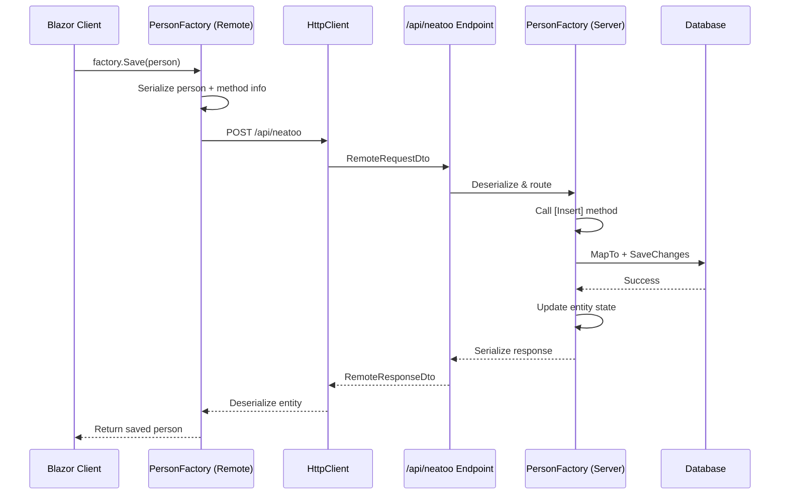

Neatoo enables a seamless 3-tier architecture where domain entities travel between Blazor WebAssembly clients and ASP.NET Core servers. The same entity class, with all its behavior and validation, executes in both environments through a single API endpoint.

## Traditional 3-Tier Challenges

Building 3-tier applications with traditional approaches creates significant friction.

### The DTO Proliferation Problem

A typical enterprise application maintains multiple representations of each domain concept:

```
┌─────────────────┐     ┌─────────────────┐     ┌─────────────────┐
│  Blazor Client  │     │   ASP.NET API   │     │    Database     │
├─────────────────┤     ├─────────────────┤     ├─────────────────┤
│ PersonViewModel │ --> │ PersonDto       │ --> │ PersonEntity    │
│   - FirstName   │     │   - FirstName   │     │   - FirstName   │
│   - LastName    │     │   - LastName    │     │   - LastName    │
│   - FullName    │     │   - Email       │     │   - Email       │
│   - IsValid     │     │                 │     │                 │
│   - Errors[]    │     │                 │     │                 │
└─────────────────┘     └─────────────────┘     └─────────────────┘
```

Each representation requires:

- Separate class definitions
- Mapping code between representations
- Synchronization when fields are added or changed
- Independent validation logic

### Duplicate Validation

Client-side validation provides immediate user feedback. Server-side validation provides security. Traditional architectures implement both:

```csharp
// Client-side (JavaScript/Blazor)
if (string.IsNullOrEmpty(FirstName))
    errors.Add("First name is required");
if (!email.Contains("@"))
    errors.Add("Invalid email format");

// Server-side (C# in controller)
if (string.IsNullOrEmpty(dto.FirstName))
    ModelState.AddModelError("FirstName", "First name is required");
if (!dto.Email.Contains("@"))
    ModelState.AddModelError("Email", "Invalid email format");
```

These implementations drift apart over time. A validation rule added server-side may be forgotten client-side, or vice versa.

### Multiple API Endpoints

Each operation typically requires its own endpoint:

```csharp
[ApiController]
[Route("api/[controller]")]
public class PersonController : ControllerBase
{
    [HttpGet("{id}")]
    public Task<PersonDto> Get(Guid id) { }

    [HttpPost]
    public Task<PersonDto> Create(CreatePersonDto dto) { }

    [HttpPut("{id}")]
    public Task<PersonDto> Update(Guid id, UpdatePersonDto dto) { }

    [HttpDelete("{id}")]
    public Task Delete(Guid id) { }

    [HttpGet("{id}/validate")]
    public Task<ValidationResult> ValidateEmail(Guid id, string email) { }

    [HttpGet("{id}/phones")]
    public Task<List<PhoneDto>> GetPhones(Guid id) { }

    // ... more endpoints for each operation
}
```

Multiply this by every aggregate in your domain, and you have dozens or hundreds of endpoints to maintain.

## Neatoo's Shared Domain Model

Neatoo takes a fundamentally different approach: **the domain model travels between client and server**.

### One Entity, Everywhere

```csharp
[Factory]
internal partial class Person : EntityBase<Person>, IPerson
{
    public Person(IEntityBaseServices<Person> services,
                  IUniqueNameRule uniqueNameRule) : base(services)
    {
        RuleManager.AddRule(uniqueNameRule);
    }

    [Required(ErrorMessage = "First Name is required")]
    public partial string? FirstName { get; set; }

    [Required(ErrorMessage = "Last Name is required")]
    public partial string? LastName { get; set; }

    public partial string? Email { get; set; }
}
```

This single class:

- **On Client**: Binds to Blazor UI, runs validation rules, tracks modifications
- **On Server**: Executes the same rules authoritatively, persists to database
- **In Transit**: Serializes with all state intact

No DTOs. No mapping code. No duplicate validation.

### The Architecture

```
┌─────────────────────────────────────────────────────────────────┐
│                     Shared Domain Library                        │
│  ┌─────────────┐  ┌─────────────┐  ┌─────────────┐              │
│  │   Person    │  │    Rules    │  │  Factories  │              │
│  │ EntityBase  │  │ RuleBase    │  │ [Generated] │              │
│  └─────────────┘  └─────────────┘  └─────────────┘              │
└─────────────────────────────────────────────────────────────────┘
         │                                       │
         ▼                                       ▼
┌─────────────────┐                   ┌─────────────────┐
│  Blazor WASM    │                   │  ASP.NET Core   │
│  (Client)       │   HTTP POST       │  (Server)       │
│                 │ ───────────────>  │                 │
│ NeatooFactory.  │   /api/neatoo     │ NeatooFactory.  │
│    Remote       │ <───────────────  │    Server       │
└─────────────────┘                   └─────────────────┘
```

Both client and server reference the same domain library. The factory mode determines whether operations execute locally or remotely.

## How [Remote] Operations Work

The `[Remote]` attribute marks factory methods that must execute on the server.

### The Request Flow

When a `[Remote]` method is called from the client:



### What Gets Sent

The serialized request includes:

```json
{
  "factoryType": "Person.Domain.IPersonFactory",
  "methodName": "Save",
  "entity": {
    "$type": "Person.Domain.Person",
    "id": "3fa85f64-5717-4562-b3fc-2c963f66afa6",
    "firstName": "John",
    "lastName": "Doe",
    "email": "john@example.com",
    "__meta": {
      "isNew": true,
      "isModified": true,
      "isDeleted": false,
      "modifiedProperties": ["firstName", "lastName", "email"]
    }
  }
}
```

The server deserializes this, routes to the correct factory method, and returns the result.

### Local vs. Remote Execution

Methods without `[Remote]` execute locally:

```csharp
[Create]  // No [Remote] - runs in browser for WASM
public void Create([Service] IPersonPhoneListFactory phoneListFactory)
{
    PersonPhoneList = phoneListFactory.Create();
}

[Remote]  // Runs on server
[Fetch]
public async Task<bool> Fetch([Service] IPersonDbContext db)
{
    // Database access - must be on server
}
```

For Blazor WebAssembly:

| Attribute | Execution Location |
|-----------|-------------------|
| No `[Remote]` | Browser (via WebAssembly) |
| `[Remote]` | Server (via HTTP) |

For Blazor Server:

| Attribute | Execution Location |
|-----------|-------------------|
| No `[Remote]` | Server |
| `[Remote]` | Server |

## The Single /api/neatoo Endpoint

Neatoo consolidates all remote operations into a single endpoint.

### Why One Endpoint?

Traditional REST APIs require one endpoint per operation:

```
POST   /api/persons           -> Create
GET    /api/persons/{id}      -> Fetch
PUT    /api/persons/{id}      -> Update
DELETE /api/persons/{id}      -> Delete
GET    /api/orders            -> List orders
POST   /api/orders/{id}/lines -> Add line item
...
```

Neatoo needs only:

```
POST   /api/neatoo            -> All operations
```

The key insight: **the client already has the entities with their behavior**. The server does not need to expose individual behaviors as endpoints. It only needs to execute entity methods that require server resources (database, server-only services).

### Endpoint Configuration

The server configures the endpoint in `Program.cs`:

```csharp
app.MapPost("/api/neatoo", (HttpContext httpContext, RemoteRequestDto request) =>
{
    var handleRemoteDelegateRequest = httpContext.RequestServices
        .GetRequiredService<HandleRemoteDelegateRequest>();
    return handleRemoteDelegateRequest(request);
});
```

This single delegate:

1. Deserializes the incoming entity
2. Resolves the appropriate factory
3. Calls the requested method
4. Serializes and returns the result

### Request Routing

The `HandleRemoteDelegateRequest` routes based on the request metadata:

```csharp
// Conceptually:
var factoryType = Type.GetType(request.FactoryType);
var factory = serviceProvider.GetRequiredService(factoryType);
var method = factory.GetType().GetMethod(request.MethodName);
var result = await method.Invoke(factory, request.Parameters);
return Serialize(result);
```

All factory operations flow through this single path.

## What Gets Serialized

Neatoo's serialization captures the complete entity state, not just property values.

### Property Values

All public properties are serialized:

```csharp
public partial Guid? Id { get; set; }          // Serialized
public partial string? FirstName { get; set; }  // Serialized
public partial string? LastName { get; set; }   // Serialized
```

### Meta-State

Entity state metadata is preserved:

| Property | Serialized | Purpose |
|----------|------------|---------|
| `IsNew` | Yes | Route to Insert vs. Update |
| `IsModified` | Yes | Determine if save is needed |
| `IsDeleted` | Yes | Route to Delete |
| `ModifiedProperties` | Yes | Enable `MapModifiedTo()` |

### Validation Messages

Validation state travels with the entity:

```csharp
// PropertyMessages are serialized
person.PropertyMessages.ToList();
// [{ PropertyName: "Email", Message: "Email is required" }]
```

The server can return validation errors that display on the client:

```csharp
// On server - in [Insert] method
if (await EmailExistsInDatabase(Email))
{
    // This message appears on client after Save returns
    AddMessage(nameof(Email), "Email already exists");
    throw new ValidationException();
}
```

### Child Entities

Child entities within the aggregate are included:

```csharp
// Parent + children serialize together
{
  "firstName": "John",
  "personPhoneList": [
    { "phoneType": "Mobile", "phoneNumber": "555-1234" },
    { "phoneType": "Home", "phoneNumber": "555-5678" }
  ]
}
```

The entire aggregate travels as a unit.

### What Is NOT Serialized

Some things do not serialize:

- **Private fields**: Only public properties
- **Services**: Resolved fresh on each tier via DI
- **Event handlers**: Reattached after deserialization
- **Navigation properties to other aggregates**: Use IDs instead

## Rules Execute on Both Tiers

This is a crucial architectural point: **the same rule code runs on both client and server**.

### Client Execution

When a user types in a field on the Blazor client:

```csharp
person.Email = "john@example.com";  // User types this
// 1. Property setter fires
// 2. UniqueEmailRule.Execute() runs
// 3. UI updates with validation result
```

Rules execute locally, providing immediate feedback.

### Server Execution

When the entity is saved:

```csharp
await factory.Save(person);
// 1. Entity serialized to server
// 2. Server deserializes entity
// 3. [Insert] method called
// 4. Before persisting, rules run again
// 5. Authoritative validation on server
```

The server re-runs rules to ensure integrity, even if the client is compromised.

### Why Run Rules Twice?

Running rules on both tiers provides:

1. **Immediate Feedback**: Users see validation instantly (client-side)
2. **Security**: Rules cannot be bypassed by modifying client code (server-side)
3. **Consistency**: Same logic, same results, no drift
4. **Offline Capability**: Basic validation works without server connection

### Async Rules and Server Resources

Some rules require server resources:

```csharp
public class UniqueEmailRule : AsyncRuleBase<Person>
{
    private readonly IEmailService _emailService;

    public UniqueEmailRule(IEmailService emailService)
        : base(p => p.Email)
    {
        _emailService = emailService;
    }

    protected override async Task<IRuleMessages> Execute(
        Person target, CancellationToken? token = null)
    {
        var exists = await _emailService.EmailExistsAsync(target.Email);
        return exists
            ? (nameof(target.Email), "Email already in use").AsRuleMessages()
            : None;
    }
}
```

On the client, `IEmailService` might call the server to check.
On the server, `IEmailService` queries the database directly.

The rule code is identical; only the service implementation differs.

## Lifecycle Diagram Reference

The complete entity lifecycle through the 3-tier architecture:

```
┌──────────────────────────────────────────────────────────────────────────┐
│                           BLAZOR CLIENT                                   │
├──────────────────────────────────────────────────────────────────────────┤
│                                                                          │
│  1. Create                          4. Edit                              │
│     factory.Create()                   person.FirstName = "John"         │
│     ↓                                  ↓                                 │
│     [Create] runs locally              Rules run locally                 │
│     ↓                                  ↓                                 │
│     Entity ready (IsNew=true)          UI updates (PropertyChanged)      │
│                                                                          │
└───────────────────────────────────┬──────────────────────────────────────┘
                                    │
                                    │ 5. Save
                                    │    factory.Save(person)
                                    │    ↓
                                    │    Serialize to JSON
                                    │    ↓
                                    ▼
┌──────────────────────────────────────────────────────────────────────────┐
│                           HTTP TRANSPORT                                  │
│                    POST /api/neatoo                                      │
└───────────────────────────────────┬──────────────────────────────────────┘
                                    │
                                    ▼
┌──────────────────────────────────────────────────────────────────────────┐
│                           ASP.NET SERVER                                  │
├──────────────────────────────────────────────────────────────────────────┤
│                                                                          │
│  6. Deserialize                    7. Execute                            │
│     Entity reconstructed              Route to [Insert]                  │
│     ↓                                 ↓                                  │
│     Services injected                 MapTo(dbEntity)                    │
│                                       ↓                                  │
│                                       db.SaveChangesAsync()              │
│                                                                          │
└───────────────────────────────────┬──────────────────────────────────────┘
                                    │
                                    ▼
┌──────────────────────────────────────────────────────────────────────────┐
│                             DATABASE                                      │
│                    INSERT INTO Persons (...)                             │
└───────────────────────────────────┬──────────────────────────────────────┘
                                    │
                                    │ 8. Success
                                    ▼
┌──────────────────────────────────────────────────────────────────────────┐
│                           ASP.NET SERVER                                  │
│                                                                          │
│  9. Update State                   10. Serialize Response                │
│     IsNew = false                      Entity + meta-state to JSON       │
│     IsModified = false                                                   │
│                                                                          │
└───────────────────────────────────┬──────────────────────────────────────┘
                                    │
                                    │ HTTP Response
                                    ▼
┌──────────────────────────────────────────────────────────────────────────┐
│                           BLAZOR CLIENT                                   │
│                                                                          │
│  11. Receive                       12. UI Update                         │
│      Deserialize response              PropertyChanged fires             │
│      ↓                                 ↓                                 │
│      Entity updated                    IsSavable = false                 │
│      (IsNew=false)                     Save button disables              │
│                                                                          │
└──────────────────────────────────────────────────────────────────────────┘
```

This diagram is also available as an animation on the [home page](/).

## Object Identity After Remote Operations

When using Remote Factory, understand that **remote operations return new object instances**.

```csharp
var person = await personFactory.Create();
var originalReference = person;

person = await personFactory.Save(person);

// These are DIFFERENT objects
Console.WriteLine(ReferenceEquals(originalReference, person));  // false
```

This occurs because:
1. The object is serialized (converted to data)
2. Transmitted to the server
3. A new instance is created on the server
4. Server performs the operation
5. The result is serialized back
6. A NEW instance is deserialized on the client

### Implications for Your Code

| Operation | Returns New Instance? | Must Reassign? |
|-----------|----------------------|----------------|
| `Create()` | Yes | Yes (to variable) |
| `Fetch()` | Yes | Yes (to variable) |
| `Save()` | Yes | **Yes - Critical!** |
| `Delete()` | N/A | N/A |

Always treat remote factory operations as returning fresh instances that must be captured.

### Common Mistake

```csharp
// WRONG - loses the new instance
await personFactory.Save(person);
// person still references the OLD object with stale state

// CORRECT - captures the new instance
person = await personFactory.Save(person);
// person now references the NEW object with updated state
```

This is especially important for:
- **Database-generated IDs**: The new instance has the ID; the old one has `Guid.Empty`
- **Server-computed values**: Timestamps, calculated fields
- **State flags**: `IsNew`, `IsModified` are updated on the new instance
- **Blazor binding**: The UI won't update if you don't reassign

See [Factory Operations - Critical: Always Reassign After Save](/reference/factory-operations/#critical-always-reassign-after-save) and [Blazor Integration](/guides/blazor-integration/#critical-reassign-after-save-in-blazor-components) for more details.

## Configuration Summary

### Client Configuration

```csharp
// Program.cs - Blazor WASM
builder.Services.AddNeatooServices(
    NeatooFactory.Remote,           // Remote mode for client
    typeof(IPerson).Assembly);

builder.Services.AddKeyedScoped(
    RemoteFactoryServices.HttpClientKey,
    (sp, key) => new HttpClient
    {
        BaseAddress = new Uri("https://your-server.com/")
    });
```

### Server Configuration

```csharp
// Program.cs - ASP.NET Core
builder.Services.AddNeatooServices(
    NeatooFactory.Server,           // Server mode
    typeof(IPerson).Assembly);

app.MapPost("/api/neatoo", (HttpContext httpContext, RemoteRequestDto request) =>
{
    var handleRemoteDelegateRequest = httpContext.RequestServices
        .GetRequiredService<HandleRemoteDelegateRequest>();
    return handleRemoteDelegateRequest(request);
});
```

### NeatooFactory Modes

| Mode | Behavior |
|------|----------|
| `NeatooFactory.Remote` | `[Remote]` methods serialize to server |
| `NeatooFactory.Server` | All methods execute locally |

## Benefits of This Architecture

### No DTOs

The entity IS the data transfer object. No mapping code to write or maintain.

### No Duplicate Validation

Write rules once. They execute on both tiers automatically.

### Single Endpoint

One POST endpoint handles all operations for all entities.

### Rich Client Experience

Full entity behavior in the browser enables:

- Immediate validation feedback
- Calculated fields that update in real-time
- Complex business logic without server round-trips

### Security by Design

Server-side execution is authoritative:

- All rules re-run on the server
- Authorization checked before operations execute
- Client cannot bypass validation

### Compile-Time Safety

Source generators catch mismatches at compile time, not runtime.

## Related Topics

- [Client Setup](/setup/client/) - Configuring Blazor WASM
- [Server Setup](/setup/server/) - Configuring ASP.NET Core
- [Factory Pattern](/concepts/factories-overview/) - Understanding factories
- [Factory Operations Reference](/reference/factory-operations/) - [Remote] and other attributes
- [Introduction](/introduction/) - Framework overview
