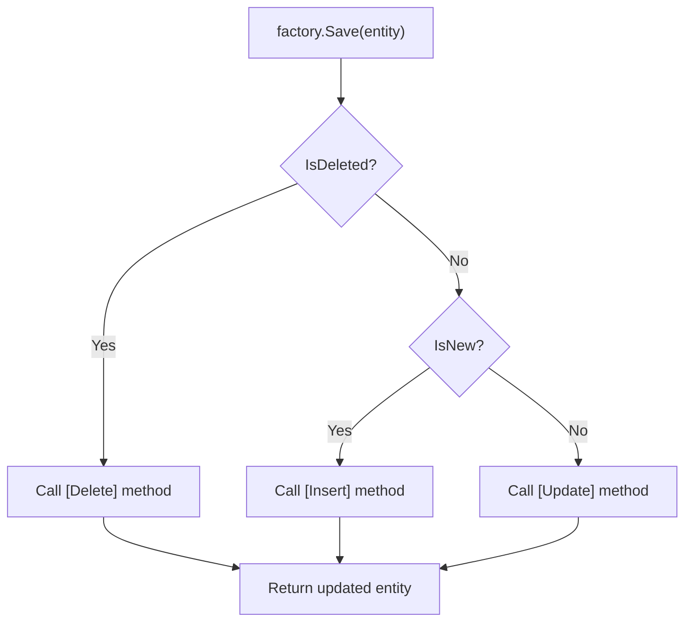
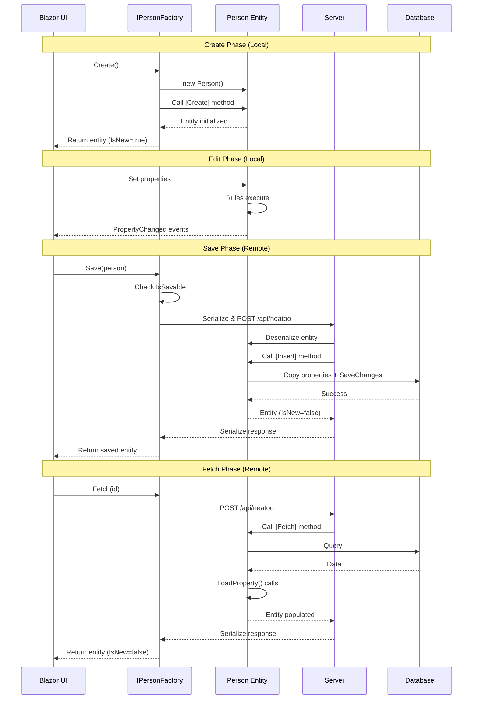

Factories in Neatoo manage the complete lifecycle of entities: creation, retrieval, and persistence. Rather than instantiating entities with `new` or scattering persistence logic across services, Neatoo generates type-safe factories from your entity definitions using Roslyn Source Generators.

## The Factory Pattern in DDD

In Domain-Driven Design, the Factory pattern encapsulates the creation of complex objects. Factories ensure that objects are always created in a valid state, with all required dependencies and invariants satisfied.

### Why Entities Should Not Use `new`

Consider what happens when you create an entity with `new`:

```csharp
// Direct instantiation - problematic
var person = new Person();
person.FirstName = "John";
// Who validates this? Who tracks modifications?
// Who knows this needs to be inserted?
```

Problems with direct instantiation:

1. **No lifecycle tracking**: The framework cannot know if this is a new or existing entity
2. **No dependency injection**: Services needed by rules and behavior are not available
3. **No parent-child wiring**: Aggregate relationships are not established
4. **No initial validation**: Rules do not run until triggered
5. **No authorization**: Anyone can create anything

Factories solve all of these problems by controlling entity instantiation.

### Neatoo's Factory Approach

Neatoo takes the Factory pattern further by generating factories automatically from your entity definitions:

```csharp
[Factory]
internal partial class Person : EntityBase<Person>, IPerson
{
    public Person(IEntityBaseServices<Person> services,
                  IUniqueNameRule uniqueNameRule) : base(services)
    {
        RuleManager.AddRule(uniqueNameRule);
    }

    [Create]
    public void Create([Service] IPersonPhoneListFactory phoneListFactory)
    {
        PersonPhoneList = phoneListFactory.Create();
    }

    [Remote]
    [Fetch]
    public async Task<bool> Fetch(
        [Service] IPersonDbContext dbContext,
        [Service] IPersonPhoneListFactory phoneListFactory)
    {
        var entity = await dbContext.Persons.FindAsync(Id);
        if (entity == null) return false;

        // Load properties without triggering rules
        LoadProperty(nameof(Id), entity.Id);
        LoadProperty(nameof(FirstName), entity.FirstName);
        LoadProperty(nameof(LastName), entity.LastName);
        LoadProperty(nameof(Email), entity.Email);

        PersonPhoneList = await phoneListFactory.Fetch(entity.Phones);
        return true;
    }
}
```

From this definition, Neatoo generates:

```csharp
public interface IPersonFactory
{
    IPerson? Create();
    Task<IPerson?> Fetch(Guid id);
    Task<IPerson?> Save(IPerson target);
    Task<Authorized<IPerson>> TrySave(IPerson target);
    Authorized CanCreate();
    Authorized CanFetch();
    Authorized CanInsert();
    Authorized CanUpdate();
    Authorized CanDelete();
    Authorized CanSave();
}
```

The generated factory:

- Provides type-safe methods matching your factory method signatures
- Handles dependency injection for `[Service]` parameters
- Routes `Save()` to the correct operation based on entity state
- Integrates authorization checks via `CanXYZ()` methods
- Manages serialization for `[Remote]` operations

### Records as Factory Targets

Neatoo 10.1.0+ supports C# records with the factory pattern. Records are ideal for Value Objects:

```csharp
[Factory]
[Create]
public record Money(decimal Amount, string Currency = "USD");

// Generated factory interface:
public interface IMoneyFactory
{
    Money Create(decimal amount, string currency = "USD");
}
```

Records support type-level `[Create]`, service injection via `[Service]` in parameters, and static `[Fetch]` methods. See [C# Records for Value Objects](/reference/base-value-objects/#c-records-for-value-objects) for complete documentation.

## Lifecycle Operations

Neatoo entities have a well-defined lifecycle managed by five factory operations.

### Create

The `[Create]` operation instantiates a new entity that has never been persisted:

```csharp
[Create]
public void Create([Service] IPersonPhoneListFactory phoneListFactory)
{
    // Initialize child collections
    PersonPhoneList = phoneListFactory.Create();

    // Set default values
    Status = PersonStatus.Active;
    CreatedDate = DateTime.UtcNow;
}
```

After `Create()`:

- `IsNew == true`
- `IsModified == true` (new entities are modified by definition)
- Entity is ready for user editing

**Usage:**

```csharp
var factory = serviceProvider.GetRequiredService<IPersonFactory>();
var person = factory.Create();
// person.IsNew == true
```

### Fetch

The `[Fetch]` operation retrieves an existing entity from persistence:

```csharp
[Remote]
[Fetch]
public async Task<bool> Fetch(
    [Service] IPersonDbContext dbContext,
    [Service] IPersonPhoneListFactory phoneListFactory)
{
    var entity = await dbContext.Persons
        .Include(p => p.Phones)
        .FirstOrDefaultAsync(p => p.Id == Id);

    if (entity == null) return false;

    // Load properties without triggering rules
    LoadProperty(nameof(Id), entity.Id);
    LoadProperty(nameof(FirstName), entity.FirstName);
    LoadProperty(nameof(LastName), entity.LastName);
    LoadProperty(nameof(Email), entity.Email);

    PersonPhoneList = await phoneListFactory.Fetch(entity.Phones);
    return true;
}
```

After `Fetch()`:

- `IsNew == false`
- `IsModified == false`
- Entity reflects persisted state
- Rules have not run (`LoadProperty` does not trigger rules)

Return `false` to indicate the entity was not found; the factory returns `null` to the caller.

**Usage:**

```csharp
var person = await factory.Fetch(personId);
if (person == null)
{
    // Entity not found
}
```

### Insert

The `[Insert]` operation persists a new entity:

```csharp
[Remote]
[Insert]
public async Task Insert(
    [Service] IPersonDbContext dbContext,
    [Service] IPersonPhoneListFactory phoneListFactory)
{
    Id = Guid.NewGuid();

    // Copy ALL properties to persistence entity
    var entity = new PersonEntity
    {
        Id = Id.Value,
        FirstName = FirstName,
        LastName = LastName,
        Email = Email
    };
    dbContext.Persons.Add(entity);

    // Persist child collection
    await phoneListFactory.Save(PersonPhoneList, Id);

    await dbContext.SaveChangesAsync();
}
```

After `Insert()`:

- `IsNew == false`
- `IsModified == false`
- Entity has a permanent identity

### Update

The `[Update]` operation persists changes to an existing entity:

```csharp
[Remote]
[Update]
public async Task Update(
    [Service] IPersonDbContext dbContext,
    [Service] IPersonPhoneListFactory phoneListFactory)
{
    var entity = await dbContext.Persons.FindAsync(Id);

    // Copy only MODIFIED properties
    if (this[nameof(FirstName)].IsModified)
        entity.FirstName = FirstName;
    if (this[nameof(LastName)].IsModified)
        entity.LastName = LastName;
    if (this[nameof(Email)].IsModified)
        entity.Email = Email;

    // Persist child collection (handles inserts, updates, deletes)
    await phoneListFactory.Save(PersonPhoneList, Id);

    await dbContext.SaveChangesAsync();
}
```

After `Update()`:

- `IsModified == false`
- Only changed properties were written
- Child collection changes are persisted

### Delete

The `[Delete]` operation removes an entity from persistence:

```csharp
[Remote]
[Delete]
public async Task Delete([Service] IPersonDbContext dbContext)
{
    var entity = await dbContext.Persons.FindAsync(Id);
    if (entity != null)
    {
        dbContext.Persons.Remove(entity);
        await dbContext.SaveChangesAsync();
    }
}
```

To trigger deletion, call `Delete()` on the entity before saving:

```csharp
person.Delete();              // person.IsDeleted == true
await factory.Save(person);   // Calls [Delete] method
```

### How Save() Routes Operations

The factory's `Save()` method examines entity state to determine which operation to call:



This routing happens automatically. You call `Save()` and the framework calls the right method.

## Method Injection with [Service]

Factory methods support dependency injection through the `[Service]` attribute.

### How [Service] Works

Parameters marked with `[Service]` are resolved from the dependency injection container at call time:

```csharp
[Remote]
[Fetch]
public async Task<bool> Fetch(
    Guid id,                                    // Regular parameter - from caller
    [Service] IPersonDbContext dbContext,       // Injected from DI
    [Service] IPersonPhoneListFactory factory)  // Injected from DI
{
    // Use id (passed by caller) and services (injected)
}
```

The generated factory method signature includes only non-service parameters:

```csharp
// Generated interface
Task<IPerson?> Fetch(Guid id);  // [Service] parameters are hidden
```

### Parameter Order Matters

Non-service parameters must come before service parameters:

```csharp
// Correct - regular params first
[Fetch]
public Task<bool> Fetch(
    Guid id,                           // Regular
    string? includeDetails,            // Regular
    [Service] IDbContext db)           // Service
{ }

// Incorrect - will not compile
[Fetch]
public Task<bool> Fetch(
    [Service] IDbContext db,           // Service cannot come first
    Guid id)                           // Regular must be first
{ }
```

### Benefits of Method Injection

Method injection has several advantages over constructor injection:

1. **Server-only services**: Database contexts and repositories are only needed in `[Remote]` methods, not on the client
2. **Lazy resolution**: Services are resolved only when the method is called
3. **Disposable services**: Services are disposed after the method completes
4. **Cleaner entities**: Constructors remain focused on entity behavior, not persistence

## The [Remote] Attribute

The `[Remote]` attribute indicates that an operation must execute on the server.

### Client vs. Server Execution

Without `[Remote]`:

```csharp
[Create]
public void Create([Service] IChildListFactory childFactory)
{
    // Executes locally - on client in Blazor WASM, on server in Blazor Server
    ChildList = childFactory.Create();
}
```

With `[Remote]`:

```csharp
[Remote]
[Fetch]
public async Task<bool> Fetch([Service] IDbContext db)
{
    // Always executes on the server
    // Entity is serialized to server, method runs, result serialized back
}
```

### When to Use [Remote]

Use `[Remote]` when the operation:

- Accesses the database (Fetch, Insert, Update, Delete)
- Requires server-only services
- Performs operations that must be authoritative
- Needs resources not available on the client

Do not use `[Remote]` when:

- The operation only initializes local state (Create)
- All required data is already present on the client
- Responsiveness is critical and no server access is needed

## Commands and Queries

Beyond entity lifecycle operations, Neatoo supports a Command/Query pattern for operations that don't fit the standard CRUD model. This is implemented using the `[Execute]` attribute on factory classes.

### When to Use Commands and Queries

Use Commands and Queries when you need to:

- Perform database lookups for validation (email uniqueness, username availability)
- Execute server-side operations that aren't tied to a specific entity
- Implement request/response patterns for specific business operations
- Create reusable server-side services callable from the client

### Basic Pattern

Create a result class with the `[Factory]` attribute and an `[Execute]` method:

```csharp
// The result class holds the query response
public interface ICheckEmailExistsResult
{
    bool Exists { get; }
}

[Factory]
public class CheckEmailExistsResult : ICheckEmailExistsResult
{
    public bool Exists { get; set; }

    [Remote]
    [Execute]
    public async Task Execute(
        string email,
        Guid? excludeId,
        [Service] IDbContext db)
    {
        Exists = await db.Persons
            .Where(p => p.Email == email)
            .Where(p => p.Id != excludeId)
            .AnyAsync();
    }
}
```

### Generated Factory Interface

Neatoo generates a factory with a delegate for the execute operation:

```csharp
// Generated
public interface ICheckEmailExistsResultFactory
{
    // Delegate property for calling the operation
    CheckEmailExistsDelegate CheckEmailExists { get; }
}

// Generated delegate type
public delegate Task<ICheckEmailExistsResult> CheckEmailExistsDelegate(
    string email,
    Guid? excludeId);
```

### Usage

Inject the factory and call the delegate:

```csharp
public class UniqueEmailRule : AsyncRuleBase<Person>, IUniqueEmailRule
{
    private readonly CheckEmailExistsDelegate _checkEmail;

    public UniqueEmailRule(ICheckEmailExistsResultFactory factory)
        : base(p => p.Email)
    {
        _checkEmail = factory.CheckEmailExists;
    }

    protected override async Task<IRuleMessages> Execute(
        Person target,
        CancellationToken? token = null)
    {
        if (string.IsNullOrEmpty(target.Email))
            return None;

        var result = await _checkEmail(target.Email, target.Id);

        return result.Exists
            ? (nameof(target.Email), "Email already in use").AsRuleMessages()
            : None;
    }
}
```

### Query vs Command

While both use `[Execute]`, the intent differs:

| Type | Purpose | Modifies Data | Example |
|------|---------|---------------|---------|
| Query | Retrieve information | No | Check email availability |
| Command | Perform action | Yes | Send notification, update status |

**Query Example:**

```csharp
[Factory]
public class GetUserStatsResult : IGetUserStatsResult
{
    public int TotalOrders { get; set; }
    public decimal LifetimeValue { get; set; }
    public DateTime? LastOrderDate { get; set; }

    [Remote]
    [Execute]
    public async Task Execute(Guid userId, [Service] IDbContext db)
    {
        var stats = await db.Orders
            .Where(o => o.UserId == userId)
            .GroupBy(_ => 1)
            .Select(g => new
            {
                Count = g.Count(),
                Total = g.Sum(o => o.Total),
                LastOrder = g.Max(o => o.OrderDate)
            })
            .FirstOrDefaultAsync();

        if (stats != null)
        {
            TotalOrders = stats.Count;
            LifetimeValue = stats.Total;
            LastOrderDate = stats.LastOrder;
        }
    }
}
```

**Command Example:**

```csharp
[Factory]
public class SendWelcomeEmailResult : ISendWelcomeEmailResult
{
    public bool Success { get; set; }
    public string? ErrorMessage { get; set; }

    [Remote]
    [Execute]
    public async Task Execute(
        string email,
        string firstName,
        [Service] IEmailService emailService)
    {
        try
        {
            await emailService.SendWelcomeEmailAsync(email, firstName);
            Success = true;
        }
        catch (Exception ex)
        {
            Success = false;
            ErrorMessage = ex.Message;
        }
    }
}
```

### Benefits Over Direct Service Calls

Using the Command/Query pattern with `[Execute]` instead of direct service injection provides:

1. **Automatic serialization** - Results serialize correctly across client-server boundary
2. **Authorization integration** - Add `[AuthorizeFactory]` for access control
3. **Consistent error handling** - Framework handles exceptions uniformly
4. **Testability** - Inject mock factories in tests
5. **Discoverability** - All remote operations visible through factory interfaces

For a complete guide on using Commands for validation, see [Database-Dependent Validation](/guides/database-validation/).

### 3-Tier Architecture

Neatoo's `[Remote]` attribute enables a clean 3-tier architecture:

```
+-------------------+       +-------------------+       +-------------------+
|    Blazor WASM    |       |   ASP.NET Core    |       |     Database      |
|     (Client)      |       |     (Server)      |       |                   |
+-------------------+       +-------------------+       +-------------------+
         |                           |                           |
         | 1. Create entity          |                           |
         |   (local)                 |                           |
         |                           |                           |
         | 2. User edits             |                           |
         |   (local rules run)       |                           |
         |                           |                           |
         | 3. Save() called          |                           |
         |-------------------------->|                           |
         |   (entity serialized)     |                           |
         |                           | 4. [Insert] executes      |
         |                           |-------------------------->|
         |                           |   (EF Core)               |
         |                           |<--------------------------|
         |                           |                           |
         |<--------------------------|                           |
         | 5. Entity returned        |                           |
         |   (IsNew=false)           |                           |
```

The entity travels between tiers, carrying its state and validation messages.

## Factory Lifecycle Sequence

Here is the complete sequence for a typical entity lifecycle:



## Viewing Generated Factory Code

Neatoo generates factory code at compile time using Roslyn Source Generators. You can view this code for debugging and understanding.

### In Visual Studio

1. Expand your project in Solution Explorer
2. Expand **Dependencies** > **Analyzers** > **Neatoo.RemoteFactory.FactoryGenerator**
3. Find the generated factory file (e.g., `DomainModel.PersonFactory.g.cs`)
4. Double-click to view the source

### Generated Code Location

Generated files are placed in your project's `obj` folder:

```
obj/
  Debug/
    net8.0/
      generated/
        Neatoo.RemoteFactory.FactoryGenerator/
          DomainModel.PersonFactory.g.cs
```

### What the Generated Code Contains

The generated factory includes:

1. **Interface definition** - `IPersonFactory` with all public methods
2. **Implementation class** - `PersonFactory` implementing the interface
3. **Local factory methods** - For non-remote operations
4. **Remote factory methods** - For serialization and server calls
5. **Authorization methods** - `CanCreate()`, `CanFetch()`, etc.
6. **Custom serializers** - For entity type handling

### Example Generated Factory

```csharp
// Generated code - do not edit
public interface IPersonFactory
{
    IPerson? Create();
    Task<IPerson?> Fetch(Guid id);
    Task<IPerson?> Save(IPerson target);
    Task<Authorized<IPerson>> TrySave(IPerson target);
    Authorized CanCreate();
    Authorized CanFetch();
    Authorized CanInsert();
    Authorized CanUpdate();
    Authorized CanDelete();
    Authorized CanSave();
}

internal class PersonFactory : IPersonFactory
{
    private readonly IServiceProvider _serviceProvider;

    public PersonFactory(IServiceProvider serviceProvider)
    {
        _serviceProvider = serviceProvider;
    }

    public IPerson? Create()
    {
        var entity = _serviceProvider.GetRequiredService<IPerson>();
        var phoneListFactory = _serviceProvider.GetRequiredService<IPersonPhoneListFactory>();
        ((Person)entity).Create(phoneListFactory);
        return entity;
    }

    // ... additional methods
}
```

### Debugging Generated Factories

You can set breakpoints in generated code:

1. Navigate to the generated file as described above
2. Set breakpoints as you would in any C# file
3. Run your application in debug mode
4. Step through factory operations

This visibility is a key advantage of source generators over reflection-based approaches.

## Complete Entity Example

Here is a complete entity with all factory operations:

```csharp
[Factory]
internal partial class Person : EntityBase<Person>, IPerson
{
    public Person(IEntityBaseServices<Person> services,
                  IUniqueNameRule uniqueNameRule) : base(services)
    {
        RuleManager.AddRule(uniqueNameRule);
    }

    // Properties
    public partial Guid? Id { get; set; }

    [Required]
    public partial string? FirstName { get; set; }

    [Required]
    public partial string? LastName { get; set; }

    public partial string? Email { get; set; }

    public partial IPersonPhoneList? PersonPhoneList { get; set; }

    // Factory Methods
    [Create]
    public void Create([Service] IPersonPhoneListFactory phoneListFactory)
    {
        PersonPhoneList = phoneListFactory.Create();
    }

    [Remote]
    [Fetch]
    public async Task<bool> Fetch(
        [Service] IPersonDbContext dbContext,
        [Service] IPersonPhoneListFactory phoneListFactory)
    {
        var entity = await dbContext.Persons
            .Include(p => p.Phones)
            .FirstOrDefaultAsync(p => p.Id == Id);

        if (entity == null) return false;

        // Load properties without triggering rules
        LoadProperty(nameof(Id), entity.Id);
        LoadProperty(nameof(FirstName), entity.FirstName);
        LoadProperty(nameof(LastName), entity.LastName);
        LoadProperty(nameof(Email), entity.Email);

        PersonPhoneList = await phoneListFactory.Fetch(entity.Phones);
        return true;
    }

    [Remote]
    [Insert]
    public async Task Insert(
        [Service] IPersonDbContext dbContext,
        [Service] IPersonPhoneListFactory phoneListFactory)
    {
        Id = Guid.NewGuid();

        var entity = new PersonEntity
        {
            Id = Id.Value,
            FirstName = FirstName,
            LastName = LastName,
            Email = Email
        };
        dbContext.Persons.Add(entity);

        await phoneListFactory.Save(PersonPhoneList, Id.Value);
        await dbContext.SaveChangesAsync();
    }

    [Remote]
    [Update]
    public async Task Update(
        [Service] IPersonDbContext dbContext,
        [Service] IPersonPhoneListFactory phoneListFactory)
    {
        var entity = await dbContext.Persons.FindAsync(Id);

        // Update only modified properties
        if (this[nameof(FirstName)].IsModified)
            entity.FirstName = FirstName;
        if (this[nameof(LastName)].IsModified)
            entity.LastName = LastName;
        if (this[nameof(Email)].IsModified)
            entity.Email = Email;

        await phoneListFactory.Save(PersonPhoneList, Id.Value);
        await dbContext.SaveChangesAsync();
    }

    [Remote]
    [Delete]
    public async Task Delete([Service] IPersonDbContext dbContext)
    {
        var entity = await dbContext.Persons.FindAsync(Id);
        if (entity != null)
        {
            dbContext.Persons.Remove(entity);
            await dbContext.SaveChangesAsync();
        }
    }
}
```

## Related Topics

- [Factory Operations Reference](/reference/factory-operations/) - Complete attribute and method reference
- [Data Mapping Reference](/reference/data-mapping/) - LoadProperty, property mapping details
- [Client-Server Architecture](/concepts/client-server/) - How remote operations work
- [Aggregates and Entity Graphs](/concepts/aggregates/) - Parent-child factory patterns
- [DDD Concepts](/concepts/ddd-overview/) - Factory pattern in DDD context
